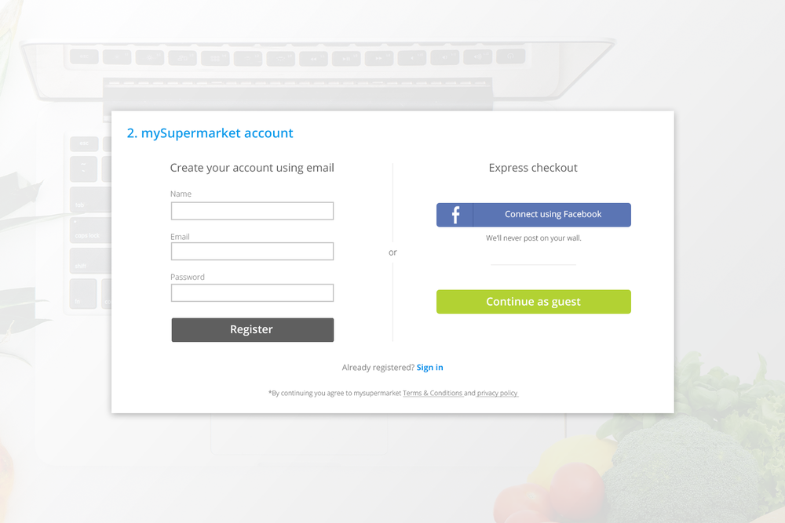
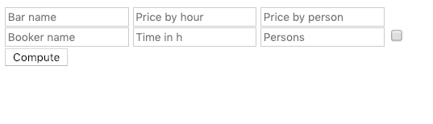

---

Continue as guest

---

💶

$300 Million

---

The results:

* Number of customers purchasing went up by 45%

---

* Extra $15 Million the first month

---

🎯 Build a clean page that computes the debit and credit price of each actors

---

🏃‍♀️ Steps to do

---

## [92bondstreet/dress-up-privateaser](https://github.com/92bondstreet/dress-up-privateaser)

---

* Help users to understand your page event they don’t know anything about your site

---

* Help users to compute the invoices in a clear and efficient manner.

---

* Help users to be clear about which action to take in a easy manner.

---

👩‍💻 Just tell me what to do

---

* Fork the project via `github`

---

* Clone the project

---

* Open /public/index.html in your browser

---

---

* Check the browser web page

---

* Commit early, commit often

---

* Don't forget to push before the end of the workshop
